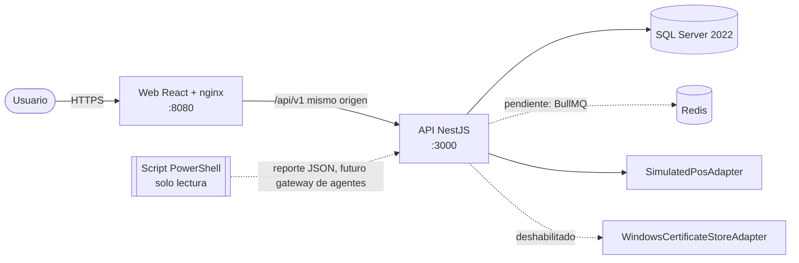
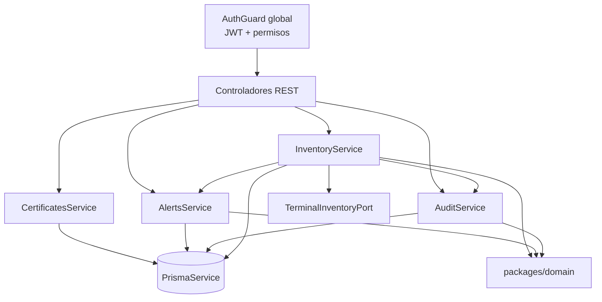

# Contenedores (C4 nivel 2)

```mermaid
flowchart LR
    user([Usuario]) -->|HTTPS| web[Web React + nginx<br/>:8080]
    web -->|/api/v1 mismo origen| api[API NestJS<br/>:3000]
    api --> db[(SQL Server 2022)]
    api -.->|pendiente: BullMQ| redis[(Redis)]
    api --> sim[SimulatedPosAdapter]
    api -.->|deshabilitado| win[WindowsCertificateStoreAdapter]
    ps[[Script PowerShell<br/>solo lectura]] -.->|reporte JSON, futuro gateway de agentes| api
```

Líneas punteadas: componentes definidos pero no operativos en esta versión.

## Componentes de la API

```mermaid
flowchart TB
    guard[AuthGuard global<br/>JWT + permisos] --> ctrl[Controladores REST]
    ctrl --> inv[InventoryService]
    ctrl --> cert[CertificatesService]
    ctrl --> alr[AlertsService]
    ctrl --> aud[AuditService]
    inv --> alr
    inv --> aud
    inv --> adp[TerminalInventoryPort]
    cert & alr & aud & inv --> prisma[(PrismaService)]
    inv --> dom[packages/domain]
    alr --> dom
    aud --> dom
```
